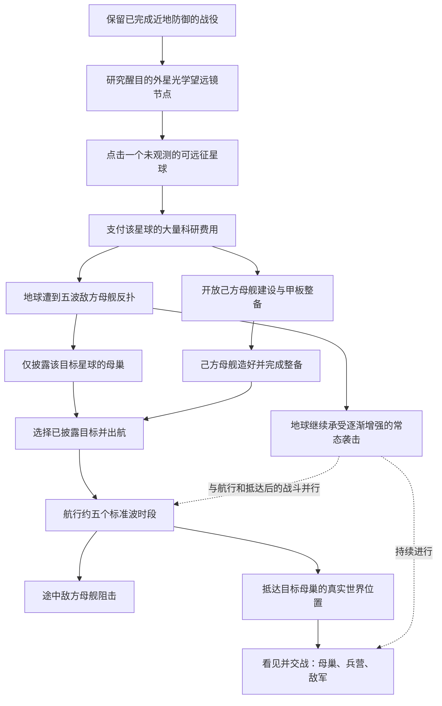

# 二阶段观测、反扑与航行：最新需求理解报告

**版本 v0.2 · 2026-09-10 · 本轮仅理解与范围报告，尚未实施**

本文以用户最新修订及其明确回复为准，覆盖 v0.1 中与之冲突的流程。已确认：**每个星球单独付费观测，完成对应反扑后仅揭露该星球的母巢，其他星球仍需各自观测。** 文中的“建议／默认解释”用于补足工程和玩法边界，不冒充用户已逐项确认的数值。

## 1. 总体理解

本轮将远征制作成可以玩的连续过程：

这里有两条同时推进的战线：地球防御；己方母舰所在的航路或目标基地。观测反扑发生在地球端，抵达远处不会让地球停止受到攻击。

本轮目标是统一、可扩展的远征流程。所有可远征星球先用相同的月球母巢和通用敌方兵营，真实差别是天体、坐标和独立状态；暂不制作六套专属阵营机制。

## 2. 与上一版方案的明确变化

| 事项 | 最新理解 |
|---|---|
| 开发期命名存档库 | 暂缓，不作为远征制作的前置。已有真实通关备份继续保留。 |
| 望远镜 | 一个醒目的科技研究节点；不另造望远镜建筑、不要求部署建筑。 |
| 研究与揭图 | 研究只解锁观测能力，不直接揭图。 |
| 观测范围 | 用户已确认：逐星付费，逐星披露。 |
| 观测的代价 | 大量科研＋对应五波母舰反扑。 |
| 造舰时机 | 反扑进行期间就可以造舰和整备，不等到全部反扑结束才开放。 |
| 披露时机 | 该星球对应五波防御完成后，才在星系中披露其母巢。 |
| 星际航行 | 约五波等效时长，可配置，过程中有实际阻击；不再是可跳过的短过场。 |
| 地球 | 始终需要维持防线，远征期间继续遭受逐渐增强的袭击。 |
| 多星球表现 | 同一月球异星母巢＋通用兵营，预留可替换类型与资源。 |
| 普通敌机 | 纳入本轮外星化模型升级，与母巢、兵营形成同一造型家族。 |
| 科技界面 | 按已确认的大小节点、连线、悬停详情、平移缩放形式，在实际 Godot 游戏中实现。 |

旧案中“地球变成和平后勤”“一次只需要一处真实战斗”“望远镜立即公开六个母巢”“30秒可跳过航行”不再适用。旧的70,000科研启动预算也不能在新增观测费用后直接沿用。

## 3. 望远镜研究与逐星观测

### 已明确要求

第一阶段完成后，在科技图谱中出现视觉非常醒目的望远镜节点。它使用大节点、明显的研究连线和望远镜图标，是进入新流程的入口。

研究完成后，玩家点击任意**可远征天体**，在该星球详情里发起观测。这里的任意天体指可远征列表，不把太阳或地球自己当作敌方观测目标。研究费用与单次星球观测费用是两笔独立支出，界面需要分别说明。

每颗星球有自己的状态：

`未观测 → 已支付／反扑进行中 → 反扑完成／母巢已披露`。

母巢未披露时可以看见天体本身，但不能通过普通相机缩放直接取得等同于付费观测的基地坐标。披露后，星图和该天体上显示可选择的母巢实体／定位，才能成为正常远征目的地。

### 建议的操作细节

- 星球详情明确显示观测科研费、当前科研、支付后的余额和“将引来5波母舰反扑”。点星球只选中，点击明确的“开始观测”才扣款。
- 每颗星球首次成功发起时扣一次；已经支付的目标，在重复点击、普通读档或防御重试时不重复收费。
- 已披露星球不再重新收费、不再重复触发这一轮观测反扑。
- 同一时刻最多一个观测反扑任务，避免连点数颗星球后无意叠出多套五波。目标选择顺序仍自由。
- 防御未完成前，观测记录持续显示其目标与进度，不把“研究了望远镜”误写为“已知该母巢”。

上述重复支付和并发限制是建议的防误操作默认，不是额外的科技门槛。

## 4. 五波母舰反扑应怎样理解

### 这是五场实际防御波，不是一个五段倒计时

敌方主力必须包含真实母舰：有世界位置、航向、生命、武器和携带／释放飞机的能力。大规模压迫通过多个母舰编队、分组接近、携机出动和持续来袭表现，不能仅换一个“母舰来袭”的文字提示。

建议每波的完成条件为：该波计划敌人已生成，并且该波仍有战斗能力的敌方母舰和飞机已被击毁或按明确规则撤退。不能只杀完几架小飞机，留下持续出兵的母舰却算清场。具体撤退规则需在实施时与现有波次结算统一。

用户要求这一段数值保持正常、不要增长太多，我理解为：**压力主要来自数量与连续性，五波内单体生命、伤害、射程和弹量不突然跨代。**

建议取首次发起时的正常地球威胁作为基线，并在这次五波内锁定。独立设置母舰数量、母舰携机量和波间增长，单体生命／伤害的波间额外增长默认0或很小；不能把旧长期征服方案的3.2、2.4指数套到这五波里，也不能让每一艘母舰额外携带一整轮第125波的敌军预算。

推荐反扑期间由特殊五波**接管地球常态刷怪调度**：原有残敌继续处理，但不再额外并行叠一套常态波。五波完成后恢复渐强的地球常态袭击。这样用户面对的是明确的“五波压力”，而不是五波之外还混入另一套不可读的增加。这条叠加策略目前是建议解释。

新反扑使用新远端来袭舰队，不重置或复活你已打掉的八艘近地母舰；历史通关资格保持。

## 5. 反扑期间建造我方母舰

支付观测、反扑开始后就开放相应造舰入口与本轮必要科技。玩家一边依靠原有地球工厂守住防线，一边造出自己的母舰并在甲板上建造战机工厂。

母舰沿用已讨论的巨大可建甲板、真实格位与工厂出口。飞机在舰上出生，离舰作战、返航修理与缺额补造；工厂跟随舰体移动和转向。甲板保留持续选中和划格建造，不恢复已删掉的手动编队。

出航同时需要：目标已披露；有已经造好、能出航的己方母舰。

- 母舰先造好：可以继续整备，等待反扑完成与坐标披露。
- 五波先打完：母巢保持已披露，等母舰造完再出发，不重新打五波或重复付观测费。
- 不强制刚披露就自动出航，玩家可以先检查地球防线和舰载编制。

地球已有飞机仍归属地球工厂。新舰载飞机归属母舰上的工厂；制造一艘母舰不应自动把所有守军搬走，否则会无提示掏空地球防线。

### 新增观测费带来的预算变化

作为理解用试算，如果一次望远镜研究仍用12,000科研、每星观测暂以40,000科研举例，真实通关档74,075.82科研可以开始观测，剩22,075.82。这里40,000不是用户已确定的最终价格。

如果仍使用旧案整条70,000科研造舰启动链，再加40,000观测，总支出变成110,000，缺35,924.18；按旧档55.19016科研／游戏秒，仅靠当前产出约需651秒。故不能继续声称原整链立刻可支付，也不能假设五波一定拖够十分钟让资源自动补齐。

实施时必须重排制造与科研的配方，或者把合理的反扑回收收益纳入预算，让此档在反扑期间能开始制造母舰；不能通过偷偷按玩家余额降价补差。研究、观测、舰体与工厂成本分别可配置。先确保新交互节奏成立，再确定最终科研价格。

## 6. 航行五波时长与沿途阻击

### 建议把“波”作为航行时长单位

航程使用独立的固定游戏时间：

`总航行时长 = 航行波单位数 × 每单位秒数`。

默认波单位数为5；例如先用现有30秒刷怪窗口作为一个参考单位，得到150个游戏秒。若希望一个单位包含间歇，改每单位秒数即可。**这里的150秒只是推荐解释，不是已经确认的最终航时。** UI应同时显示航程进度和剩余时间，避免玩家不知道“五波”是否包含清场。

观测反扑是五次实际清场，航行是固定时长，两者不能共用完成计数。全局暂停同时停两处战斗和航行；全局速度按同一规则影响它们；切换镜头不影响计时。

### 途中阻击是实际战斗

母舰在世界空间沿路径前进，敌方母舰在航路附近的较大空间范围分组出现、接近并攻击。它们主要威胁我方母舰与舰载机，不能错误攻击遥远地球的生命值。

我方舰载机自动从移动甲板出击、拦截、返航；母舰航路目标保持稳定。阻击敌军有独立的数量、携机、生命、伤害和出现节奏，不借用地球波次或地球目标引用。

我的推荐是：战损和火力对抗照常，但存活的阻击敌人本身不无限延长固定航程；母舰被击毁／失去航行能力则进入失败或恢复流程。若以后要做引擎减速、封锁导致停船，应作为明确的新规则，不在这一版暗加。

抵达时不能突然清掉追兵或弹体，也不能凭空发击杀奖励。优先让仍在有效追击范围内的敌军进入抵达后的战斗，远处敌军按明确脱离追击规则撤退。到达演出不等于免费清场。

## 7. 地球持续受袭与两处战争并行

反扑之后，地球的常态进攻继续逐渐增强；我方母舰离开或抵达目标，都不会终止地球端防御。

推荐以当前有效地球防御档位为出发点，延续可配置的平缓成长。保存旧125波历史，但二阶段地球常态波、某星球观测反扑波和航路阻击各有独立计数，不直接把125当作第一波反扑的母舰数量，也不把旧累计108分钟全部套成新航路满级弹幕。

界面保留紧凑的“地球／远征母舰”切换与非当前战线的受袭提示，不自动频繁抢镜。玩家在甲板建设、星球观测、科技研究和第一人称观战期间，只有明确的全局暂停才冻结其他战线。

当前代码需要实质调整：main把非地球视角当成暂停，Battlefield也只有一套敌群和波计时。新版本必须分离“镜头正在看哪里”和“哪里正在战斗”。至少支持地球战域与当前远征战域并行推进，不能用给地球后台扣一点血的方式伪装成完整防御。

性能上可以只精细渲染当前镜头附近的场景，远处降低模型和装饰效果成本；但后台仍要计算守军、目标、伤害、补造与结果。当前没有作战的其余天体保留静态基地状态即可，不必让六个未访问星球同时运行完整机群AI。

## 8. 抵达后的母巢与兵营

到达后进入目标天体附近的真实战场。应该能看见天体表面／附近空间、敌方母巢、一个通用兵营以及敌军。母舰和飞机有真实比例与空间关系，不是屏幕背景换图。

母巢与兵营是实际敌方对象，应有独立ID、阵营、所属星球、生命、碰撞／受击位置和毁坏状态。兵营定期生产敌机，有实体开启和敌机从出口飞出的动画；摧毁兵营停止该兵营后续生产。母巢是可选中、可攻击的主要基地对象，通用战斗与摧毁状态不依赖某一星球写死的分支。

本轮至少做通“真实抵达→看见基地→兵营出敌军→交战并摧毁目标”。专属将军、不同星球的大招、将军核心和高级进化仍属于此前的后续规划，不混成这次已明确主线完成的必要门槛。

## 9. 所有星球复用月球母巢，但保留多态

每个星球拥有独立的基地实例和状态，即使它们现在引用同一套模型。月球被观测或兵营被摧毁，不改变火星同类建筑的状态。

建议通过配置与可替换行为类型表达：

- `SectorDefinition`：目标天体、半径／局部坐标系、母巢与兵营摆放、敌群配置。
- `HiveDefinition / BarracksDefinition`：场景资源、生命与产兵规则、实际出兵锚点。
- `EnemyFactionProfile`：普通飞机与敌母舰模型、材质、武器和动画资源。
- 通用战斗／观测／航行控制器：管理共同流程；日后通过具体资源或策略类型替换，而非在大脚本中不断增加`if planet_id == ...`。

首版所有可远征星球都绑定同一月球母巢定义和同一兵营定义。不同半径／地表法线通过通用建造表面适配，模型贴合当地表面并随天体变换；不靠“只在月球坐标正确”的一次性摆放。

本轮不为六颗天体分别编写反射、热量、寄生等专属机制。多态预留必须让未来能够替换这些能力，但不提前制造空的复杂技能系统来拖慢通用流程。

## 10. 月球母巢与普通敌机的外星感

月球母巢保留镜面、月冕与核心的主题，但去掉人类城堡、厂房、跑道、楼层和规则窗格的观感。

### 母巢

主体是偏心的深层核腔，周围由不完全闭合的弧环、悬浮护片和不对称分瓣结构构成。构件之间留出可见的空隙与负形，内层发光能量沿非直线结构流动，让它像外星文明制造的巨大生命—机械体。

材质使用少量黑镜／金属弧面配陶瓷或岩质外壳、局部冷色能量。大剪影优先，细节沿结构组织；不靠全表面噪声、密集灯带或强反光掩盖造型。

### 通用兵营

兵营像从同一母巢生长／制造出来的出兵器官：分瓣甲壳包围断环形出口，产兵时展开、核腔亮起，飞机从真实出口移出。它应小于母巢且轮廓更紧凑，但二者明显属于同一阵营。

### 普通敌机与来袭母舰

普通敌机保留可辨的战斗类型，外观统一为偏心核心、分叉／镰翼、分离护片和陌生武器结构。不同类型通过轮廓与武器器官区分，不把同一架人类飞机换个颜色算完成。

来袭与阻击母舰也应与这套外星家族一致。敌方造型与我方清楚可见的大甲板、人类工业模块形成辨识差异；正常缩放和第一人称下都应能分辨阵营与威胁体量。

所有模型仍使用干净的PBR、有效LOD、共享材质和真实发射锚点。阴影、爆炸、出兵动画与命中位置必须配合模型，不制作只有展示效果、却和战斗无关的空壳。

## 11. 科技树的本轮范围

使用已确认的PoE式图谱表现：大小节点表达重要度、前置连线、悬停查看详情、点选锁定、平移缩放、清楚区分已购／可购／未解锁。它必须是游戏中的可操作科技UI，不只停留在设计网页。

一阶段按此前确认的24节点压缩组织，保留旧科技购买权益与既有数值曲线。望远镜作为大节点突出，说明“研究后可对星球付费观测”，不能继续用旧文案“研究即公开六母巢”。

本轮远征树至少包含本流程实际可用的观测、造舰、甲板工厂、舰载机、生产与航行支持研究。此前72节点是完整长期规划；暂未实现的专属将军／进化效果不能先开放购买并收费。当前所需节点要有真实统计效果、成本和前置，缺资源时说明具体缺口。

## 12. 可配置项与生效时机

| 参数组 | 内容 | 本次明确值／建议 |
|---|---|---|
| 研究 | 望远镜一次性研究价格 | 具体费用待调；与观测费分开 |
| 观测 | 每目标观测科研费 | 大额、可配；每星独立已支付记录 |
| 反扑 | 波数 | 用户明确默认5波，可配 |
| 反扑 | 母舰数量基数、每波增量、携机量、来袭批次 | 独立预算；不再乘一整轮地球敌群 |
| 反扑 | 单体生命／伤害基数与五波内增长 | 保持正常；建议额外波间增长0或很低 |
| 反扑 | 刷怪窗口与波间间歇 | 独立配置，真实清场后计入完成波数 |
| 造舰 | 舰体、船坞、工厂成本与制造时间 | 应确保反扑期间可开始造舰 |
| 航行 | 波单位数、每单位秒数／总时长 | 默认约5波时段，时间可配；150秒为示例 |
| 阻击 | 母舰批次、间隔、携机量和战斗强度 | 独立于地球和观测反扑 |
| 地球 | 续战基线、数量成长、生命／伤害成长与间隔 | 持续、平缓变强，不复活旧八母舰 |
| 基地 | 通用母巢／兵营生命、产兵周期、每次出兵量 | 全星球首版共用类型，实例状态独立 |

一次任务开始时锁定配置，后续参数修改默认作用于下一波／下一次观测／下一次航行。已支付任务不能因为改价或重载再扣一次；调整航时也不能让同一航程在两个时钟之间跳变。

## 13. 进度保存与本轮暂缓项

命名存档库、修订列表和收藏UI暂不做。已有通关档备份保留，正式制作前使用副本验证迁移。

普通战役存档仍须补齐新流程必要状态：每星观测付款／反扑进度／披露状态、母舰与甲板、当前目标、航行时间与路线、地球续战计数、当前远征阶段和通用基地毁坏状态。这属于让新玩法正常继续，不是另做存档库。

若首版仍采用安全检查点，应保存并恢复两条战线的同一一致性状态，不得恢复一边、跳过另一边的未结算战斗。完整现场快照没有实现前，不承诺每颗弹体都原样续接。观测失败重试建议保留付款资格和已完成波；失败波从其合法检查点重来，避免每次失败又损失一大笔科研。

这一轮的明确验收聚焦：逐星观测、五波反扑、母舰建造与甲板、披露、可计时航行、途中阻击、持续地球防御、通用基地交战、外星资产与真实科技图谱。六套专属星球玩法、专属将军及其核心进化不在本轮主线里抢先铺开，长期设计继续保留。

## 14. 实施前应按本理解验收的情形

1. 载入真实地球通关副本，历史八母舰仍为已毁；可研究望远镜，但尚无母巢自动披露。
2. 选择月球、支付观测，科研只扣一次；重复点击、读档不会重复收款。
3. 五波实际敌母舰反扑进行，单体强度没有跨代爆涨，同时能开始造舰和建甲板工厂。
4. 第五波完成只披露月球，其他星球仍未披露；月球状态不会因切镜头丢失。
5. 造舰较慢或较快都能正常接出航，不重新付费或重打观测波。
6. 航程按独立固定游戏时间推进，暂停／倍速统一生效；途中存在真实母舰阻击。
7. 看母舰时地球守军仍作战、补造并承受伤害；回看地球时航行和阻击也继续。
8. 抵达后看见同一空间中的母巢、兵营和敌军，兵营从自身出口生产，能被攻击摧毁。
9. 换选任何其他可远征星球，同样流程可用，各自支付、披露和建筑状态互不串档。
10. 航程抵达、双方毁灭、重载及参数修改等边界不重复奖励、不清掉另一战线，也不以假后台扣血代替真实防御。

以上是我对最新需求的完整理解。尚未指定的航行周期秒数、反扑叠加与失败重试等，本文已明确写为建议解释；最终实现应采用同一套已定规则，避免不同控制器各自猜测。
