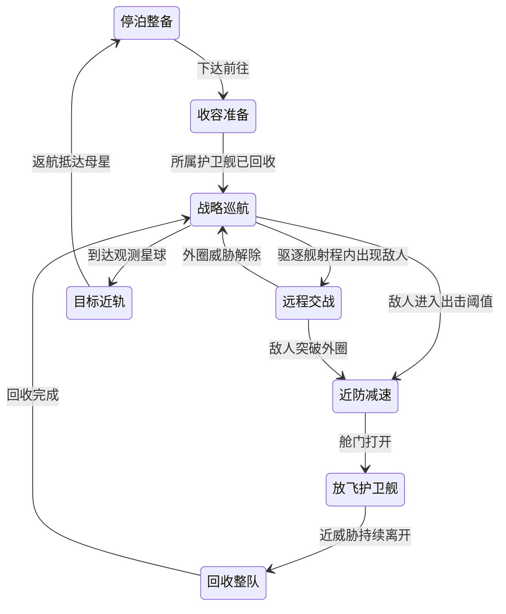

# EARTHWARD：星舰模块与护卫舰体系完整设计案

版本：设计案 v1.0｜日期：2026-09-10｜状态：已暂缓；当前优先地球防御、工厂永久特性与三次母舰外推

本轮交付设计与实施规划，没有修改游戏运行代码、启动脚本或玩家存档。本文是主方案；专项审查笔记用于追溯分析，发生差异时以本文明确的推荐默认值为准。表格中标为“硬要求”的内容来自玩家，其他数值与补充规则是本次提出的设计建议，不代表已经确认或经过实机平衡验证。

## 1. 要让玩家体验到的变化

第二阶段从“造更多小飞机”进入“设计一支有分工的舰队”：驱逐舰在外圈用远程重炮开路，母舰提供移动机库、补员和支援，护卫舰在威胁突破外圈后出动。模块改变真实武器、飞行和防御行为，外观也跟着改变。科技决定能用什么，核心决定能把多少实际编制装备起来。

配装发生在玩家选中的真实舰体上。沿用当前点击聚焦、跟随和薄荷色悬停轮廓，舰首、中段、尾段出现少量部位指引；点击一个槽位才展开小型候选卡。无需新增全屏设计器、常驻属性大表或单独库存页面。

参考《群星》的重点是舰段与合法组件的对应、武器和辅助的分工，以及构筑对战斗角色的影响。其官方开发日志介绍了舰段、不同组件位置和舰载机/点防御的角色；本项目采用自己的经济、槽数、实时操作与世界空间战斗规则。[官方开发日志 #17：舰船设计、#18：舰队战斗](https://store.steampowered.com/news/posts/?appids=281990&enddate=1454328724&feed=steam_community_announcements)。

### 1.1 硬要求与补全决策

| 项目 | 本方案 |
|---|---|
| 全系统延后开放【硬要求】 | 首次星舰发射井完工时，统一开放模块研究、舰体部位 HUD、护卫舰升级和舰载生产。这一具体触发点是推荐默认值 |
| 护卫舰来源【硬要求】 | 仅母星工厂与母舰自动生产；没有直接购买护卫舰的按钮 |
| 护卫舰槽位 | 舰首 2 个武器槽；中段推荐 1 个装甲槽；没有尾段槽。中段数量是补全建议 |
| 驱逐舰槽位【硬要求】 | 舰首 3 武器槽，中段 3 个防御辅助/驱逐火炮/装甲槽，尾段 1 推进槽 |
| 母舰槽位【硬要求】 | 舰首 4、中段 4：辅助或装甲；尾段 4：推进 |
| 射程【硬要求】 | 驱逐舰基础主炮射程 = 同科技进度下护卫舰管辖基准半径 × 5 |
| 驱逐舰数值 | 整舰基础 HP 与主武器总 DPS 默认各为基准护卫舰的 100 倍，独立可配；速度、转向、射速、弹数、减伤百分比不直接乘 100 |
| 研发与安装【硬要求】 | 模块研究消耗外星科技点；新制造的每件模块消耗资源核心，并搭配常规资源费用 |
| 操作【硬要求】 | 点击真实舰体 → 部位 HUD → 槽位 → 局部更换卡；费用与效果当场可见 |
| 自动补员费用 | 推荐装备归属“具体生产编制位”，该位阵亡补造继承已付费模块；扩容的新位置不免费复制 |
| 内容规模 | 首版 16 个模块家族、每家族 3 级研究；3 种可装配舰体、32 个模块装配资源、5 项生产结构改造 |

### 1.2 延续现有玩法的边界

- 第一阶段仍使用现有飞机、工厂产能、核心升级与科技体验；模块系统不会提前介入。
- 既有科技、工厂类型、生产容量和存档投入均保留。升级为护卫舰时分配原有输出预算，随后由新模块带来真实增量。
- 延续当前尺寸：驱逐舰约为小型舰的 5 倍，母舰约为 8 倍；护卫舰不因改名而突然放大。发射井保持 19 格大蜂窝占地。
- 保留当前星球间距、地球左侧星舰集结位置、全画幅相机、科技侧栏卷轴动画、世界空间点击聚焦和第一人称观战。
- 保留首次清空近地母舰后的五轮停战与之后持续进攻，不恢复“反扑”、舰艇轨道、旧甲板建造或小飞机手动编队。
- 护卫舰不恢复血条，继续使用残血闪红；同阵营之间不增加碰撞。

## 2. 当前工程基础与必须补齐的缺口

| 当前真实状态 | 本次必须完成的连接 |
|---|---|
| 星舰已有排队生产、起飞、转移、停靠，但没有 HP、主武器或远航作战 | 加入可受伤的星舰实体、独立武器硬点、实际远航指令与敌军目标支持 |
| 小飞机已有工厂归属、缺额补造和回厂行为 | 抽出地表工厂/移动母舰共同的生产源与编制位；母舰归航不能继续围绕地球计算 |
| 小飞机目前单个开火计时器、单个出弹来源 | 改为双硬点；驱逐舰三硬点及可选中段炮，各自拥有目标、炮口与冷却 |
| 现有驱逐舰有八座装饰炮台，母舰机库为刚性外观 | 清理假炮台，制作准确的 3 前炮位置和 3 可选中段炮位；母舰机库变成可开闭和实际通行的结构 |
| 已有空间索引、目标分摊、飞机合批 | 在其上扩展长射程查询、在途伤害预留、按外观件合批，避免每艘增加一堆独立处理节点 |
| 后续持续进攻母舰目前没有稳定外星点奖励 | 同步增加可持续研究收入，否则研究迟早断供 |
| 科技图前置已统一并修复 | 新模块继续使用同一真实依赖定义，图线、说明、购买条件保持一致 |

证据入口：[星舰生命周期](D:/MyGame/EarthDefense/scripts/starship_fleet.gd:101)、[现有武器发射](D:/MyGame/EarthDefense/scripts/battlefield.gd:1385)、[持续母舰奖励映射](D:/MyGame/EarthDefense/scripts/battlefield.gd:1728)、[奖励账本](D:/MyGame/EarthDefense/scripts/game_state.gd:451)、[星舰模型](D:/MyGame/EarthDefense/scripts/starship_models.gd:16)、[合批渲染](D:/MyGame/EarthDefense/scripts/fleet_batch_renderer.gd:46)。行号为本次审查时的位置。

**完整首版必须能实际远航、交战、受损、补员、回收并读档继续。只完成配装 HUD，不能算这次系统落地。**

## 3. 三类舰的定位与插槽

| 舰级 | 定位与自动行为 | 舰首 | 中段 | 尾段 |
|---|---|---|---|---|
| 护卫舰 F / S 规格 | 快速近防、清理小目标、拦截可拦截弹药；受母港管辖 | 2：增幅或武装特化，每槽对应一门基础武器 | 1：装甲 | 0 |
| 驱逐舰 D / M 规格 | 远程主力，优先大型舰/工事，在途火力分配；随母舰巡航 | 3：增幅或武装特化 | 3：防御辅助、独立火炮或装甲 | 1：推进 |
| 母舰 C / L 规格 | 移动机库、补充护卫舰、舰队支援；进入近威胁区后减速放飞 | 4：辅助或装甲 | 4：辅助或装甲 | 4：推进 |

母舰没有进攻主炮。近防辅助可以击落敌方导弹、鱼雷，首版不把它变成能远程炮击敌舰的隐藏武器。驱逐舰不开放机库和舰队指挥模块，保持三类舰的职责区别。

“空武器槽”表示没有额外模块，基础炮仍然能开火。增幅模块改造原炮；特化模块替换该硬点的武装与行为，两者不能占同一个槽。护卫舰可以一边使用基础动能增幅、一边使用特化导弹，不要求两门炮同类。

现有动能、激光、导弹工厂分别保留对应的默认护卫舰配装。共同舰体通过鼻部炮组、导弹匣或能量聚焦器区分，工厂投资继续决定默认生产方向，模块提供后期跨类型调整能力。

### 3.1 百倍数值的计算方式

以未升级的动能小飞机作为计算示例，现有基数约为 45 HP、30 DPS：

| 项目 | 原飞机 | 升级后裸装护卫舰 | 裸装驱逐舰，倍率 100 |
|---|---:|---:|---:|
| 舰体生命 | 45 | 45 | 4,500 |
| 主武器总输出 | 30 DPS | 30 DPS | 3,000 DPS |
| 主武器数量 | 1 | 2 | 3 |
| 每门平均预算 | 30 | 15 | 1,000 |

一门驱逐舰主炮装上 +30% 增幅，全舰为 3,300 DPS；三门都装为 3,900。中段火炮每门建议增加基础主武器总预算的 20%，即示例中 600 DPS；三门共 +60%，代价是中段不能再装防护或辅助。

计算顺序：基础舰体与武器 → 已拥有的第一阶段科技 → 各硬点模块 → 本舰防护/辅助/推进 → 外部支援 → 每项属性上限。旧三联齐射的 1/0.5/0.5 伤害权重计入原有总预算，不能在每个新炮口再次完整叠乘。连续光束和 AOE 分别核算持续输出与多目标输出。

驱逐舰基础 HP、伤害倍率分开配置，默认 100；已有同源护卫舰盾量也可按对应盾倍率继承，无基础盾时仍为零。武器射速与转向按舰级独立设计：重炮长装填、转向较慢，护卫舰反应快。只提高数量型战斗属性；准确率、减伤、速度、齐射弹数等不套用百倍。

母舰建议基准 HP = 驱逐舰的 3 倍，无主炮，12 个内置护卫舰编制、2 个并发出入口。该基数必须与现有 5 倍驱逐舰造价一起测试：如果维修、拦截与持续补员不能让“1 母舰 + 3 驱逐舰”在长途战中与等价 8 驱逐舰形成合理选择，应调整支援能力或造价，不能只以模型体积证明它值这个价格。

### 3.2 五种范围必须分清

| 参数 | 语义 |
|---|---|
| `frigate_home_radius` | 护卫舰围绕母港执行任务的管辖基准；地表使用现有球面作战域，自由空间使用移动中心 |
| `weapon_range` | 从真实炮口到目标的有效距离，各武器独立 |
| `pursuit_leash` | 为完成拦截可暂时越出的边界，超过后重新选敌或返航 |
| `sensor_range` | 能建立火控目标的探测距离；不能看见地球后的单位就穿球开炮 |
| `carrier_launch_radius` | 远航中触发护卫舰出击的近威胁距离 |

驱逐舰主炮距离 = **母舰护卫舰的自由空间管辖基准 × 5 × 本舰合法射程修正**。不是把地球工厂的球面巡航弧长直接乘五，也不取任意一架的临时最大值。地球留守护卫舰保留现有球面航程和全部已付科技权益。

这里存在必须解决的尺度冲突：原 125 波档的动能球面管辖约 15.135，直接乘五是 75.675；当前月球约距地心 29.35、火星约 58.62，会允许停在地球直接炮击母巢。自由空间母舰护卫圈是新作战域，建议按旧科技收益压缩映射，保持正向增益但不复制整段地表弧长：

```text
reference_preset = kinetic  # 固定基准，不能随某艘临时配装变化
legacy_gain = max(1, 当前基准球面管辖 / 同参数下未研究时基准球面管辖)
R_free = 1.25 × (1 + 0.25 × log2(legacy_gain))
R_destroyer = 5 × R_free
```

上述 1.25 世界单位基数与 0.25 科技映射系数独立可配。示例：未研究基准为 2.0，通关档 15.135，则 `R_free ≈ 2.16`、驱逐舰约 `10.81`，保留五倍关系并需要实际远航抵近月球。该转换只定义新母舰作战域，不缩短已有地球巡防。未来射程模块/科技在此基数上独立增长；不把旧武器绝对射程再次叠加到驱逐舰。

实机验收必须包含“通关档从地球泊位打不到月球/火星母巢，实际抵近后可以攻击”。使用真实距离、遮挡与观测信息，不以母巢隐藏免疫或低于标称炮程的虚假探测上限补救。参数故意调到极大时允许真实远程攻击，默认平衡范围由几何测试保证。

护卫舰仍有价值：它们能高速转向、近距离跟踪小目标与鱼雷；重炮适合大目标，炮口转向与命中预测构成真实限制。不得用“小目标完全免疫大炮”这样的硬免疫补救数值，也不能让百倍伤害通过无限转速重炮包办所有工作。

## 4. 初版 16 类模块

T1 表内数值为建议初值，均需实测。S/M/L 是装配规格，研发按家族通用，实例按规格制造，不允许把一枚小舰模块直接变成母舰大模块。

| ID / 家族 | 合法位置 | T1 效果与取舍 | 作用范围 |
|---|---|---|---|
| W01 武器增幅器 | F/D 舰首 | 本炮 DPS +30%，保留基础武器；不能同时装特化 | 当前硬点 |
| W02 穿甲磁轨 | F/D 舰首 | 改为高速磁轨；对大目标基准 DPS +15%，忽略 35% 装甲减伤，装填较长、跟踪较慢 | 当前硬点 |
| W03 聚焦光束 | F/D 舰首 | 改为持续束；对同一目标保持 0.8 秒后逐步达到 1.4 倍基础输出，换目标重新蓄束 | 当前硬点 |
| W04 追踪弹头 | F/D 舰首 | 改为可拦截的追踪导弹；总单目标预算不凭空增加，获得有限小范围爆炸、付出飞行与被拦截风险 | 当前硬点 |
| W05 驱逐重炮 | 仅 D 中段 | 增加独立炮位，提供主炮基础总 DPS 的 20%；占掉一个辅助/装甲位置 | 新增硬点 |
| A01 复合装甲 | F 中段；D 中段；C 前/中 | 基础 HP +25%，各件同类加算；通用可靠但没有针对性抗性 | 本舰 |
| A02 反应装甲 | 同上 | 额外基础 HP +10%；对动能/爆炸类伤害减免 25%，对光束无额外抗性 | 本舰 |
| A03 烧蚀装甲 | 同上 | 额外基础 HP +10%；对能量/光束伤害减免 30%，不能覆盖所有敌人 | 本舰 |
| U01 护盾电容 | D 中段；C 前/中 | 每件增加本舰基础 HP 的 20% 为盾容量；脱战 5 秒后再充能 | 本舰 |
| U02 近防拦截 | D 中段；C 前/中 | 自动拦截可拦截导弹/鱼雷；分配拦截目标，基础炮弹与光束不可拦截 | 本舰近防区 |
| U03 维修单元 | D 中段；C 前/中 | M 自修、L 维修近处友舰；固定治疗预算，战斗中仅 25% 效率 | 本舰或周围友舰，规格明确 |
| U04 机库扩容 | 仅 C 前/中 | 每件 +4 护卫舰编制；一舰最多 2 件，新增编制默认无付费模块 | 本母舰 |
| U05 指挥链路 | 仅 C 前/中 | 邻近武装舰射速 +12%；同名支援取最高，不递归增强自身光环 | 支援范围内友舰 |
| P01 巡航推进 | D/C 尾段 | 战略巡航速度 +20%；不直接提高战斗转向 | 本舰 |
| P02 加力推进 | D/C 尾段 | 战术速度 +20%，加速 +25%；不改变战略旅途标称速度 | 本舰 |
| P03 矢量推进 | D/C 尾段 | 转向 +30%，制动 +25%；改善换向与接敌，不增加武器射程 | 本舰 |

### 4.1 三级增量、堆叠与配装约束

- 增幅器：T1/T2/T3 对该炮 +30%/+60%/+100%。装甲、护盾、推进与支援收益默认随等级按 1/1.5/2 比例递增，具体数值在模块数据中显式列出。
- 特化不把所有属性同时倍增：磁轨提升穿透与大目标输出，光束提升稳定聚焦上限，导弹提升追踪/有效爆炸预算；投射物数量不能每级自动翻倍。重炮预算为主炮基础总量的 20%/30%/40%。
- 机库扩容每件 +4/+6/+8 编制，仍最多 2 件；总容量 = 12 + 两件实际增加的编制数，单件或混装分别结算，不把升级后的新增编制免费装满。
- 同舰维修单元最多 1 个，指挥链路最多 1 个；其他可以重复，但必须展示叠加结果。母舰四个尾槽允许混装或同类堆叠。
- 装甲/盾量取基础舰体数值，不对已经增加的 HP 循环取百分比；各伤害类型最终减伤上限建议 70%。穿甲先削减装甲减免，再计算最终伤害，不穿透全部护盾和生命。
- 同名外部光环取最高等级；维修按装置的固定预算按需分给目标，多母舰总治疗仍有每目标上限。推荐 M 维修每秒 0.3% 同科技基准 D HP；L 总治疗预算为其 3 倍，进入战斗再乘 25%。
- 对同一速度属性的模块增益建议上限 +80%；火控命中、转速、冷却都有独立合法范围。HUD 显示封顶后的实际变化，不销售“增加了但没生效”的假收益。
- 首版不再引入能源槽、反应堆货币或舰体质量配平页面，复杂度由槽位竞争承担。技术上保留字段，后续有需要再扩展。

### 4.2 初版可验证的构筑

| 配装 | 预期行为 | 明确牺牲 |
|---|---|---|
| 近防护卫舰：双基础炮增幅 + 复合甲 | 追小目标、拦截逼近鱼雷，补员便宜 | 缺乏对大舰穿甲 |
| 对舰护卫舰：磁轨 + 导弹 + 反应甲 | 在母舰近防域内围攻大型威胁 | 对高速小目标和弹药拦截较弱 |
| 炮击驱逐舰：磁轨主炮 + 3 中段重炮 + 巡航推进 | 最大化远程投送与重火力 | 中段没有近防、盾和装甲，需要护航 |
| 护航驱逐舰：混合主炮 + 近防/护盾/维修 + 矢量推进 | 稳定保护母舰、减少航行战损 | 放弃额外三门重炮 |
| 远征母舰：指挥 + 维修 + 2 机库，余位防护；尾部混合推进 | 补员、火控支援与持续作战 | 自身不能远程清场，必须带驱逐舰 |

## 5. 研究、核心与长期经济

### 5.1 接入现有科技画布

首次发射井完工后，在原有外围展开醒目的“模块化舰队”枢纽，枢纽为自动里程碑，不额外索取一次入场科研费。由此分出武装、装甲、辅助、推进四个方向；重炮是武装分支中的驱逐舰节点。不要重新增加“地球/远征”分页。

16 家族各有 3 个等级节点，共 48 个付费研究节点，另有 1 个自动解锁枢纽和 2 个进度门。普通节点、家族节点、枢纽使用不同尺寸；家族之间留出明显走线空隙。悬停显示合法槽位、效果、费用和全部前置；点击研究后的“查看适用舰”沿用当前聚焦入口。

| 等级 | 外星点建议 | 科研建议 | 前置 |
|---|---:|---:|---|
| T1 | 1 | 2,000 | 首次发射井完成 |
| T2 | 3 | 8,000 | 本家族 T1 + 任一星球观测完成 |
| T3 | 7 | 32,000 | 本家族 T2 + 首个母巢被实际击毁 |

进度门在解锁后的画布中可见，不能有隐藏的不可达前置。T2 足以完成第一个通用母巢，T3 是胜利后的升级选择，不能让母巢要求先拿它自己解锁的 T3 才能打。研发解锁蓝图，不自动提高已装模块等级；高阶模块需要在槽位里支付差额升级。旧版已付费的远航、伤害、齐射等科技继续生效，不重复售卖同一权益。

### 5.2 稳定奖励来源

实查发现：后续持续进攻母舰当前被归入普通巡洋舰/资源小 Boss 奖励，缺少稳定外星点；新模块必须与奖励修正一起交付。

推荐每波指定一艘有辨识度的指挥母舰，首次击毁给 **1 外星点**；普通新增母舰默认 0 点。资源核心默认每波 5 个的奖励单独保留，可由同一艘携带两个独立奖励条目。波数中断时奖励随目标保留，不能自动凭时间发放，也不能刷新或读档重复领取。

每个星球母巢首次被攻克额外建议 5 外星点（可按未来星球多态改成 3–8）；其奖励 ID 持久化。后期母舰越来越多时，科研收入仍按指挥目标控制，避免无意中变成每波几十点。

不依赖赠送起步点数解除死锁：零外星点、零闲置核心时，裸装护卫舰/驱逐舰仍可开火，原地球防线能继续争取下一波奖励。首版建议不额外引入自动维护费、弹药费；母星工厂沿用现有补造规则，母舰补造默认也只消耗制造时间，常规资源补造成本字段保留并默认 0。

### 5.3 核心投资与费用示例

| 规格 | T1 新模块核心 | T2 | T3 | T1 常规制造费建议 |
|---|---:|---:|---:|---|
| S 护卫舰 | 1 | 2 | 4 | 100 矿物 + 50 能量 |
| M 驱逐舰 | 2 | 4 | 8 | 1,000 矿物 + 600 能量 |
| L 母舰 | 2 | 4 | 8 | 2,000 矿物 + 1,200 能量 |

上述为规格默认费，各模块可以配置特殊成本；T2/T3 常规制造费建议为 T1 的 2/4 倍。研究与安装费用不得混用同一个折扣字段。

- T1 满配单个护卫舰编制需 3 核心，满配驱逐舰 14 核心，满配母舰 24 核心；母舰内护卫舰编制另算，卡片必须写清。
- 同规格同家族升级按核心与制造费的差额支付，原模块 UID 升级，不再生成一份旧件。跨家族更换时旧件进入可复用库存，新件另付；库存就在候选卡中展示数量。
- 复用已拥有模块不再次付核心，仅收小额整备费；每个模块最初都经过核心制造。首版不开放卖回原始核心，消除折扣和拆装套利。
- 一艘 T1 驱逐舰约消耗三波核心收入，母舰约五波，尚未扣地球资源建筑和增产需求；不保证每波都能把新舰装满。
- 16 家族全部三级共需 176 外星点和 672,000 科研。单个家族全研究为 11 点，一条 3–4 家族构筑为 33–44 点；应先让一种构筑成形，再追求全树，而非要求清空科技树才能远征。
- 按每波 1 点、有效波间隔 45–75 秒估算，全树约 2.2–3.7 小时战斗进度；这是公式示例，实际时间受当前波长、击杀率、已有点数和首杀奖励影响，必须用实测调节。

现有原始第 125 波通关备份约有 24 外星点、378 核心、20.5 万矿物、20.4 万能量、7.4 万科研。足以尝试多个 T1 配装，但不应因此跳过新玩家零储备校验。当前 D/C 造船时间为 30/90 秒，加最后一艘起飞转移约 24 秒，一口井立即排 D+C 已约 144 秒，接近 150 秒停战期；不能承诺停战期同时足够玩家观测、学习配装并完成全部整备。保留手动暂停，不因打开配装或科技自动改变世界时间。

## 6. 装备归属、自动生产与战损

### 6.1 为什么装备绑定具体编制位

护卫舰不由玩家直接建造，若按每次死亡重新扣核心，弱势时核心会被补员自动抽干；若按工厂一次付费无限复制，后期扩容会免费制造大量高级装备。

推荐规则：每个生产源有稳定编号的编制位，每个位置有自己的两前一中配装。该位的护卫舰被毁后，原位下一艘继承装备，不再付核心；新的容量产生空编制位。模板仅是设计，批量应用时按需要的真实模块数量计算总费用。

例：工厂 12 个位置，玩家只给 3 号位安装 1 核心增幅。只有 3 号位受益；这艘阵亡后补出的 3 号位继续受益。将同一增幅应用到另外 11 个位置，明确再需 11 核心，不能免费复制。

### 6.2 生产与回收状态

每个编制位最多一艘有效护卫舰，状态区分：空缺 → 制造 → 待发射 → 出动 → 作战 → 返航 → 停靠/维修。返航、维修、正在发射都占编制，不能按“当前不在战场上”再造一艘。

母星工厂补造基数保留现有 5 秒与科技系数；母舰建议 8 秒基数，2 条制造线，2 个并发出入口，均可配。新母舰启用后从空机库逐步生产，不直接凭空刷满。生产、维修、门口通行是不同队列；维修不应该阻塞所有制造，门口发射与回收有明确优先级和短锁，不能相互穿插。

容量减少优先收回空位；仍有船的多余位置标记“退役待归航”，不立刻销毁。卸掉机库模块前候选卡显示会减少的编制及处置：受影响的船回收，付费装备进入库存；正在交战不能强制卸库把在飞单位删除。

### 6.3 死亡与装备损失

- 护卫舰阵亡：沿用当前死亡爆炸；附近有敌人时重伤优先冲撞，安全时返修。自身配装仍归原编制位，按原规则补造。
- 驱逐舰/母舰：不继承护卫舰自动殉爆；重伤保持撤退/护航行为，母舰优先保护回收路线。
- 推荐首版大舰被毁损失船体、生产时间和当前航行进度，已安装模块转为“回收中”，60 秒后进库存；不返还原始核心，不允许同一模块重复回收。后续若加入实体残骸打捞，可以替换这一回收策略。
- 母舰损毁时，其闲置编制装备一并进入回收账本；在飞护卫舰的装备先随该舰保留，不能同时进入库存。它们寻找可达且有空编制的母舰/母星工厂，转归时先原子预留目标空位并暂停其补造，再转移舰与装备。优先空白位；目标位已有付费配置时先将其模块归入库存，不能覆盖吞件。无母港则暂为失联护航单位，不自动补员、不瞬移消失。
- 失联护卫舰死亡时只结算一次装备回收；已回收的原编制不能继续生成它。造船、模块与编制均使用唯一 ID 防止复制。

## 7. 母舰远航与完整战斗循环

### 7.1 基础舰队操作

选中母舰的既有上下文位置提供“前往 / 返航 / 停泊”。点击“前往”才进入目标选择，选择已观测星球并确认目的地；普通左键点星球始终只是切换观察，不偷偷下航行指令。

附近空闲驱逐舰可通过同一上下文的“随行 X 艘”勾选加入母舰护航集合，默认建议附近未编入其他舰队者；每艘只能有一个归属。无需恢复小飞机手动编队面板。护卫舰只随自己的母港行动，出征不抽走地球工厂的留守飞机。

舰队巡航速度取随行大舰可维持速度的较小值，推进改装卡分别显示“本舰速度”与“当前舰队速度”；单改母舰不会把跟不上的驱逐舰甩下。出航进度按真实路程累计，新增独立的星际参考距离/巡航速度参数标定旅途时间，交战减速会延长 ETA，不能计时结束直接传送到星球。现有 18 秒 `starship_transit_seconds` 只用于出井后前往地球左翼集结，保持原用途，不作为星际航程。

### 7.2 航行状态机



推荐出击阈值为 `0.60 × 护卫舰管辖半径`；敌人退出 `0.85 × 半径` 持续 3 秒后召回。不同开/关阈值防止边界反复起落，单次出击最短 5 秒。高速敌弹接近母舰也可以作为近防威胁，但护卫舰不会为已经不可能拦住的一颗炮弹徒劳起飞。

战略巡航中护卫舰留在机库，远程火力由驱逐舰承担。敌人逼近后母舰降到战术速度；出舱时继承母舰世界速度，再加相对发射速度。归航朝母舰未来截获位置飞行，只有进入门口回收走廊后才切入母舰局部坐标。

母舰恢复高速前等待回收，默认 10 秒宽限后继续低速接应并显示“等待 X 艘”，不能无反馈卡死。上下文提供明确“紧急撤退”动作，放弃本次回收、保留失联舰实体，付出风险换取母舰安全；不瞬间传送护卫舰。原母舰仍存活时，失联舰继续占据原编制位，只有确认阵亡或完成原子转归才释放，不能撤退一次就多补一批。

到达目标后仍在真实世界空间：通用母巢、兵营和当地敌军具有 HP、武器、奖励与击毁状态，驱逐舰建立轰击距离，母舰保持支援位置，护卫舰在近域保护。首版各星球仍使用通用月球母巢与兵营逻辑，通过派系/星球数据接口预留后续变化，不借本次配装追加六套未完成的特殊 Boss。

### 7.3 战斗可靠性与敌我公平

- 每个前炮独立转向、锁定与冷却，导弹/实弹从真实炮口发射，光束方向与模型瞄准一致。中炮只在装有该模块时存在。
- 选敌保留现有空间索引与目标分摊，增加按预计命中时间的在途伤害预约；目标已被足够弹药覆盖时，后续炮口换目标。弹药失效、目标死亡、遮挡都会释放预约。
- 护卫舰按母港分配不同警戒扇区与截击位置，使用软性位置分摊，不添加同阵营碰撞，也不让数百舰追同一点。
- 敌人按本地战区选择地球、舰队或护卫舰。长程敌军不能借某个遥远驱逐舰的射程，全局获得炮击地球的资格。
- 有护航的母舰受敌舰攻击时，敌方必须已进入随行武装的反击覆盖或护卫舰可出击拦截区；无武装护航的母舰不是无敌，敌方可逼近其近防域后攻击。
- 敌方重炮 AOE 保留，但伤害、半径、目标筛选独立配置。加入可辨识的鱼雷/远程炮舰接敌组合，让近防与装甲有价值；不靠让敌军无预警在反击范围外秒杀玩家制造难度。
- 光束按固定战斗时间步累计伤害；高速弹药用扫掠检测，命中查询包含新大舰与护卫舰。切相机不会停掉地球或远征战区的逻辑。


## 8. 舰体部位 HUD：操作与视觉规范

### 8.1 正常配装流程

1. 鼠标经过舰体沿用现有薄荷色细轮廓。左键短点选中并聚焦/跟随；拖动仍然旋转视角，不触发选择。
2. 视角稳定后约 0.15 秒淡入部位入口。护卫舰只显示“舰首 2 / 装甲 1”两个入口，大舰显示三个。标签靠模型外围，短而细的线连接真实部位。
3. 点击一个部位，只展开这一段的槽位。母舰最多展开四个，不同时铺十二条长线。图标表示模块，小角标标记等级，空槽使用简洁轮廓。
4. 点击槽位，在旁边展开宽约 320–360 px、高不超过 420 px 的局部候选卡，只列合法模块。显示当前值→预计值、作用范围、库存数、核心和常规资源费用。
5. 悬停候选时预览外观与部位轮廓，尚不改变实际战斗数值。点击一次“更换 · 核心 N”提交，没有额外重复确认框。
6. 整备期间部位显示短进度弧；结束时模型、武器参数、库存与费用一起生效，配合轻微装配声和短光效。

卡片示例：

> 舰首 02 · 基础动能炮 → 武器增幅器 I  
> **本炮 DPS：15 → 19.5**　全舰：30 → 34.5  
> 归属：动能工厂 07 · 编制 03  
> 新造 1 件：核心 1 · 矿物 100 · 能量 50  
> [更换]　[套用至同源其他编制…]

“套用至同源”在同一张卡内展开数量/已有装备/总价，不新开管理页。默认只改当前编制；批量时显示跳过多少同配装位置、复用多少库存、需新造多少件。可选择“全部”或“按当前可支付数量”，不能未经选择就部分购买。

### 8.2 状态反馈与输入

| 状态 | 表现和操作 |
|---|---|
| 未研究 | 灰色模块、锁图标、准确前置；“定位科技”打开既有侧栏画布并定位节点 |
| 余额不足 | 余额/所需价同时可见，不能提交；不增加无意义弹窗 |
| 战斗或远航中 | 可预览；按钮改为“安排整备”，提示需要返港/安全停泊 |
| 护卫舰在机库里 | 点击工厂/母舰的机库部位选具体编制位，在同一局部卡配装；不必等起飞后追着点 |
| 对象太小 | 一个紧凑选中标记，主动聚焦后展开；不让满屏小舰都出现标签 |
| 部位在舰体背面 | 少量虚线提示，允许主动绕舰查看；不自动二次转镜头 |
| 被星球遮挡 | 隐藏被挡的槽位入口，禁止穿星球点选 |
| 接近屏幕边缘 | 卡片自动翻边并留安全距离，必要时收起非当前段标签 |
| 目标死亡/删除来源 | 关闭未提交预览；按事务状态结算预留，不能错装到自动选中的下一艘舰 |
| 保存与读档 | 只关闭未提交的外观预览；已预留/施工订单连同进度恢复，不退款、不重扣、不从头施工 |

右键/Esc 按候选卡→槽位→选中逐层退出。科技拖拽、地表连建、太空旋转、暂停与第一人称输入有明确优先级；按下与释放绑定同一目标 UID，拖拽越过舰体不算购买。配装不改变 FOV、视口尺寸、游戏画幅或侧栏之外的相机参数。

### 8.3 整备事务与防止刷血

推荐整备时长 F 3 秒、D 6 秒、C 10 秒，均可配。F 回所属机库，D/C 在母星停泊或脱战后的安全整备状态完成，只锁正在整备的舰。

安排时一次预留资源/库存，卡片标明“已预留”；实际开始前再次验证目标、槽位、科技、所有权和状态。未开始可取消并完整释放；施工期间不能通过取消反复刷新状态。目标在提交前被毁（包括施工中），新预留只释放一次，旧模块按战损规则处置。若整备已经提交，则新模块属于舰体，走战损回收，不能同时再退款。同帧完工/死亡按事件序号与事务修订确定唯一先后。

生命、护盾保留原百分比；武器保留标准化冷却进度且满足最短开火间隔。换甲不回血，换炮不重置射速，换推进不跳位置，换机库不复制飞机。费用、模块所有权和持久化使用同一个事务 ID。

## 9. 美术、模型、动画和音效制作清单

### 9.1 设计语言

人类舰队采用浅灰陶瓷外板、深色金属骨架、拉丝金属边缘、克制的青色导航灯。大块面负责轮廓，小结构在近景起作用；避免满船小灯和高频凹槽导致远景闪烁。

护卫舰短而利落，双舰首武器清晰；驱逐舰沿长轴布置三个前部独立武器平台；母舰是有厚度的宽体机库，前/中八个装配座嵌入船体，四个尾接口可辨。保留当前大舰尺度与阵营气质，重新组织真实结构。

磁轨使用双导轨与后坐座，光束使用聚焦环和散热片，导弹使用封闭弹匣与开盖机构。增幅是附着基础炮的供能套件，不能装上之后炮消失。三甲分别用连续覆板、错列反应块、分层隔热板；推进器分别呈现长喷流、宽加力喷口、可偏转喷嘴。

### 9.2 精确首版建模列表

**32 个模块装配资源 + 3 个舰体 + 5 项生产结构改造 = 40 项制作/改造条目。** 每个规格是可直接安装、单独验证的完整资源，可共享底座和几何。T1/T2/T3 共用模型，通过灯带/材质细节分级，不把等级重复算成新模型。

| 编号 | 制作/改造资产 | 数量 | 必需结构 |
|---|---|---:|---|
| H-F01 | 护卫舰共同舰体 | 1 | 双炮座、中段装甲接口；动能/激光/导弹基础炮配套计入本项；无尾槽 |
| H-D01 | 驱逐舰模块化改造 | 1 | 移除八座假炮；三前炮、三中通用座、一尾接口 |
| H-C01 | 母舰模块化改造 | 1 | 四前/四中/四尾接口、机库入口与停机深度 |
| M-W01-S/M | 增幅套件 | 2 | 小/中炮适配座、供能环，保留真实炮口 |
| M-W02/03/04-S/M | 磁轨、光束、导弹 | 6 | 旋转/后坐、聚焦器、开合弹匣 |
| M-W05-M | 中段重炮 | 1 | 底座、旋转/俯仰、后坐、炮口 |
| M-A01/02/03-S/M/L | 复合、反应、烧蚀三甲 | 9 | 三类舰体曲面适配，不简单放大穿模 |
| M-U01/02/03-M/L | 电容、近防、维修 | 6 | 电容舱、近防炮口、维修工作臂/发射口 |
| M-U04-L | 母舰机库扩容组件 | 1 | 增容舱段、机械门；增加储位而非随意复制外部出口 |
| M-U05-L | 指挥链路 | 1 | 可动通信阵列、低强度工作灯 |
| M-P01/02/03-M/L | 巡航、加力、矢量推进 | 6 | 喷口、加力段、矢量关节、尾焰挂点 |
| F-K/F-L/F-M | 三类母星工厂机库升级 | 3 | 真门洞、升降/整备位、各类生产识别装置 |
| F-C | 母舰双舷机库制作 | 1 | 门、回收走廊、简化内部泊位、独立通行锁 |
| F-S | 19 格发射井适配 | 1 | 大舰起飞净空、升降台、蜂窝门组动画 |

为验证战术，另对现有外星舰做 **3 项低成本识别改造**：小型突击型、鱼雷投射型、远程炮击/指挥型，复用外星母体，分别强化前刺、侧向卵囊、背部光冠。它们不是额外三套人类模块舰，也不要求重做所有敌舰。每波指挥目标用模型及短选中提示识别，不恢复“XX 航道”常驻 HUD。

### 9.3 动画、特效、音效

| 类别 | 必做动作/效果 | 验收标准 |
|---|---|---|
| 护卫舰 | 生产升降、出厂、双炮错相、起飞加力、闪红、回收、维修、殉爆 | 来自具体门和炮口，沿用无血条设计 |
| 驱逐舰 | 三主炮瞄准/后坐、中炮、巡航/战术喷流、盾/甲受击 | 朝向与攻击一致 |
| 母舰 | 门开闭、分批放飞、移动回收、维修支援、天线、四尾喷流 | 不穿模、不瞬移，不全船过量闪光 |
| 模块 | 安装动作、装甲覆盖/卸下、弹匣、近防、矢量偏转 | 家族描述至少对应一种可辨表现 |
| 战斗 | 动能、磁轨、光束、导弹/鱼雷、近防命中、有限 AOE | 共享低成本资源，命中/落空可区分 |
| 交互/声音 | 选中、展开、预览、完成、拒绝、武器/机库声音 | 短而克制，上千舰不逐只播放同音量 |

工厂、母舰与发射井共用动画事件：`door_ready`、`launch_release`、`recovery_capture`、`refit_commit`。结算发生在正确事件点，缺失事件有超时保护与日志，不能坏一扇门就永久锁队列。

### 9.4 制作预算

建议近景舰体预算：F 2–4k、D 12–20k、C 18–30k 三角；模块 S 150–500、M 400–1,200、L 600–1,600。远景按投影尺寸切 LOD，F 远景约 150–350 三角，不可见小模块并入简化轮廓。这是上限目标，不以用满预算为质量标准。

共用 PBR 材质/图集，粗糙度变化尺度合理，避免整船镜面；所有挂点从模型资源读取。只给少量近景/选中舰高精关节，远景降低动画细节但保留正确火力与炮口语义；不为每个舷灯放实时灯。


## 10. 工程架构与可配置参数

渐进扩展现有 Dictionary Actor、空间索引和 MultiMesh，不整体换框架。菜单、科技、模型和战斗引用同一组定义。

| 数据/服务 | 职责 |
|---|---|
| `ShipDefinition` | 舰级、基数、尺寸、基础武器、生产规则 |
| `SlotSpec` | 稳定槽 ID、部位、合法标签、规格、模型/炮口挂点 |
| `ModuleDefinition` | 家族、等级、科技、费用、属性、行为、外观、堆叠 |
| `OwnedModule` | 唯一 UID、定义 ID、所有者、库存/安装/预留/回收状态、支付快照 |
| `Loadout` | 每槽模块，当前生效与待整备版本 |
| `ProductionSource` | 地表工厂/移动母舰的世界位置、速度、容量、出入口和队列 |
| `ProductionBerth` | 编制 ID、默认预设、已付配装、当前舰 UID、制造/回收状态 |
| `HardpointState` | 每炮目标、瞄准、冷却、炮口、在途伤害预算 |
| `StatResolver` | 按科技/配装/参数修订号编译属性，仅相关变化时重算 |
| `RefitService` | 预览、校验、预留、提交、取消的一致事务 |
| `FleetOrder` | 母舰目的地、随行驱逐舰、状态、路程与回收决策 |
| `CombatSpaceQuery` | 地球/自由空间统一目标、遮挡、扫掠命中、战区索引 |

禁止 HUD、科技树和战斗各自硬编码一份兼容矩阵。资源每帧增长不触发全舰属性重编译；只有相关科技、配装、参数或光环集合变化更新缓存。

### 10.1 参数入口

接入已有“参数”入口的折叠分组，不新增面板。显示单位、基数和倍率，射程显示计算后的世界距离。

| 参数组 | 必须开放的字段 / 推荐值 |
|---|---|
| 舰体 | D HP/DPS 各 ×100、C HP 为 D ×3、D 射程 ×5；自由空间护卫基数 1.25、旧科技对数映射系数 0.25；速度/转向/射速/弹速独立 |
| 模块费 | S/M/L 核心 1/2/2、等级倍率、每模块覆盖值、制造/整备费 |
| 研究 | T1/T2/T3 外星点 1/3/7、科研 2k/8k/32k、前置数据 |
| 奖励 | 每波指挥 1 艘、外星点 1、普通外星点 0、核心 5、母巢首杀 5 |
| 母舰 | 基础编制 12、制造 8 秒、制造线 2、门口并发 2、整备 10 秒 |
| 星际航行 | 独立的参考距离/巡航速度或参考旅途时长；本地集结仍用原 18 秒 |
| 回收 | 出击 0.60R、退出 0.85R、无威胁 3 秒、最短任务 5 秒、回收宽限 10 秒 |
| 模块效果 | 各级数值、范围、同舰上限、堆叠方式、减伤上限 70%、速度增益上限 +80% |
| 战斗/表现 | 转速、选敌周期、锁定时间、弹药寿命、AOE 半径/预算、动画/VFX 上限 |
| 战损 | 模块回收延迟 60 秒、返还策略、补造常规成本默认 0 |

倍率字段保持至少 128 的既有调试范围；HP/DPS 倍率建议上限 10,000，给 100 默认值留下调节空间。概率/减伤、时间、距离使用各自合法区间，不能所有字段都套无单位滑块。热改只更新对应缓存，不重置血量或冷却。槽位结构保存在数据定义中，不在战斗参数里任意删槽。开发强制解锁不污染正式永久里程碑。

### 10.2 避免交战 CPU 回退

- 机库中的编制只保存数据，没有逐舰寻敌、绘制和 `_process()`。
- 护卫舰不创建独立炮塔脚本；批量更新炮口、火光和弹道共用的变换。
- 基础舰体共用，模块按外观件/材质/LOD 分桶；不按任意配装组合生成每船独立网格材质。近景组合缓存有上限。
- 远程大舰使用粗层候选表，不能按五倍射程遍历巨大网格包围盒；近防弹药单独维护可拦截集合。
- 选敌、支援集合和分区错帧更新，运动/冷却使用稳定时间步；每帧预算不能让炮口明显落后于发射方向。
- 预计伤害预约减少无用弹药；不只删特效却继续生成大量逻辑子弹。连续光束合并固定步结算，保留双/三炮语义。
- 仅选中舰计算部位 HUD；世界点击先粗筛，再精确检测少量候选，不给上千合批护卫舰创建 UI 节点。

## 11. 存档迁移和代码清理

永久里程碑只记录一次。旧档已有发射井、星舰或已付款订单任一，推定已达门槛；丢失最后一口井不退化。未达门槛的档不提前激活。

迁移流程：验证原档 → 在独立候选快照生成生产源与稳定编制 → 填入基础硬点、空模块 → 保留科技、HP 比例、位置/速度、UID、工厂计时、订单与相机目标 → 验证新快照 → 原子写入。不能边读边扣资源。

现状：顶层存档 v3、星舰 v2、远征状态 v4、远征运行时 v4。实际落地统一升级有关 schema 与兼容路径。未知模块先隔离并显示待修复，不直接删除付费财产；非法组合拒绝提交，不悄悄默认化后覆盖原档。

必须保持两个不变量：每个模块只在一个槽位/库存/预留/回收位置；每个编制最多一艘有效舰。死亡、扩容、转移、批量整备、取消、存读、奖励领取均验证。取消造舰按原订单金额只退一次，不按后来改过的造价反算。

原第 125 波通关备份保持原样；开始开发前另备份 LaunchDebug 当前继续玩的进度。Launcher 继续通关开发分支，不反复重置到 125 波。交付演示“迁移→保存→退出→重开→同一舰同一编制继续航行”。

清理旧单炮的冗余分支、假炮台、重复费用表和临时 HUD；第一阶段需要的路径必须保留。已经删除的甲板建造、舰艇轨道、小飞机手动编队不借机恢复。

## 12. 落地顺序与每阶段完成标准

数据与资产可并行，但玩家首个可玩交付必须覆盖 P1 的完整链路。P0 不是可玩版，P1 也不冒充 16 家族已全部完成。

| 阶段 | 交付内容 | 通过条件 |
|---|---|---|
| P0 基线与数据 | 备份、性能基线、槽位/编制/装备账本、永久门槛、持续奖励、迁移基础 | 新旧档一致；未解锁阶段不变；费用/兼容单一来源；奖励不锁死/重复 |
| P1 三舰完整切片 | 6 家族：增幅、磁轨、复合甲、近防、机库、巡航推进；三舰真实挂点、局部 HUD、移动母舰、实际敌我战斗 | 研究→付款→模型/武器变化→出航→远击→近敌放飞→战损补造→回收→存读→返航，全部可操作 |
| P2 全内容与表现 | 16 家族、48 研究节点、32 装配资源、三工厂/母舰机库/发射井动画、库存与批量整备 | 每个效果真实生效；槽位与研究定义可达；T3 母巢门的实玩验证在 P3 完成；制作清单逐项验收 |
| P3 远征与平衡 | 实际抵达已观测星球；通用母巢/兵营作战；首杀/T3；地球持续压力 | 零储备和通关档均可循环；不用 T3 也能首杀；至少三种有意义构筑；母舰经济价值成立 |
| P4 性能与回归 | 原生交战基准、输入冲突、长时运行、重复存读、代码清理 | 不以空场/Headless 代替交战；已修功能保留；LaunchDebug 可继续玩 |

P1 至少有一条真实航线与途中战斗，P3 扩展完整星球攻略和奖励。模型细化可持续提高，但门洞、硬点和槽位结构在 P1 就必须正确。不能把三门炮最后才塞进装饰模型。

**建议第一步做统一编制/槽位账本与六模块的三舰闭环。** 它会尽早验证移动机库、百倍炮火的目标分摊、模块所有权、付费事务、性能和老档迁移。通过后扩足内容，避免把最大的风险留在最后。

## 13. 最终验收清单

### 13.1 玩法与数值

- [ ] 发射井前没有模块系统；之后一次开放，拆井不回退。
- [ ] F 2/1/0、D 3/3/1、C 4/4/4；错误类型在 UI/服务/存档一致拒绝。
- [ ] 双/三前炮可不同武装独立开火，中炮仅安装后出现，母舰无隐藏主炮。
- [ ] 裸装能战斗；D 全舰基础输出是同科技基准 F 的 100 倍，不再乘枪口数；范围是五倍管辖基准。
- [ ] 至少三种构筑在小目标、重目标、长途损耗场景各有优势，不存在无代价全能解。
- [ ] 出征不抽空地球；远击→近防成立；敌军能实际命中新大舰。
- [ ] 通关档默认地球泊位不能直接炮击月球/火星母巢，远航抵近可打；地球留守球面航程不缩短。
- [ ] 战损补员、重伤返修/冲撞、母舰损毁、失联转归有实机记录。
- [ ] 指挥奖励、核心、首杀各只结算一次；零外星点仍有后续收入。
- [ ] 每级前置可达；T3 不挡首杀；模块升级保留既有科技与支付差额。

### 13.2 财产与操作

- [ ] 一个已装备编制死亡/补造 20 次不重复扣核心；扩容 10 位不复制模块。
- [ ] 批量预览/扣款一致；双击、余额变化、死亡、取消、存读不吞/复制模块。
- [ ] 换甲不回血，换盾不充满，换炮不跳冷却，换机库不删除在飞护卫舰。
- [ ] 舰体选择、镜头旋转、科技拖拽、连建、太空拖动、第一人称无输入冲突。
- [ ] 1440×900、1920×1080、2560×1440 卡片不越屏；母舰默认不铺 12 条 HUD；不挤世界画幅。
- [ ] 各舰有原生装配与交战录屏；移动机库出入无穿模/瞬移。
- [ ] 原始备份未变，当前开发档迁移后退出重开可继续。

### 13.3 性能交付

固定硬件、分辨率、画质、种子和存档，比较原场景与升级场景的 60 秒巡航、60 秒交战及突发 AOE/补员峰值。记录 CPU/GPU 帧时中位数和 P95/P99，并分拆寻敌、武器、弹道、生产/回收、模块更新、渲染提交。

建议普通压力档：500 F + 12 D + 2 C；较高档：1,000 F + 32 D + 4 C，各自加入对应敌人和可拦截弹药。实际敌军数、同时弹药峰值写进报告，不只说“很多飞机”。保留原大规模地球交战回归。

300 FPS 对应约 3.33 ms 帧间隔，仍是目标而非已证明结果。必须记录 CPU、分辨率、战场规模与 CPU/GPU 限制，不能因为显卡是 4090 就承诺。第一阶段同场景 P95 建议不退化超过 5%；新内容超预算优先修查询/弹道/合批，不偷偷削减玩家设定的逻辑舰数。

## 14. 本版范围与交付边界

本版覆盖三舰模块、科技经济、实际战斗、移动机库、局部 UX、模型动画和存档。暂不增加自由拼接舰段、舰内建筑编辑器、舰长、随机词条、独立物流航线、六套星球特殊 Boss 或新币种；保留通用接口，让已要求的玩法先完整运转。

上述范围控制不能成为缺项的解释：模块没有真实效果、母舰不会移动生产/回收、星舰不受伤、科技缺前置、核心重复扣费，都属于未完成。

## 附：专项审查与来源

- [战斗与数值审查](D:/MyGame/EarthDefense/design/fleet-modules/combat-review.md)
- [UX 与资产审查](D:/MyGame/EarthDefense/design/fleet-modules/ux-assets-review.md)
- [工程完整性审计](D:/MyGame/EarthDefense/design/fleet-modules/engineering-review.md)
- [《群星》官方舰船设计与战斗开发日志](https://store.steampowered.com/news/posts/?appids=281990&enddate=1454328724&feed=steam_community_announcements)：仅参考舰段/组件/角色原则，不以早期日志声称当前游戏版本机制，也不作为本项目数值来源。

主方案明确规则、接口与验收边界。所有平衡初值必须在 P1/P3 的实际战斗与经济回放中定标，完整性最终由可玩实机版本证明。

