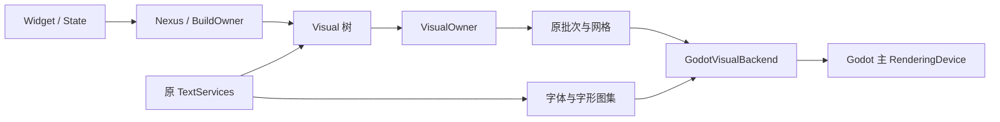

# SkrGui C# / Godot

本模块已收纳于 EarthDefense 的 `libraries/SkrGui/`；仓库根目录的 `LaunchSkrGui.cmd` 会转到本模块启动。以下相对路径与命令均以本模块目录为基准。

这是对 ExtremeEngine SkrGui 的逐源码 C# 移植。固定参考提交为 `611561f81534354c8c1618dc27c4782cd9277cbf`，参考工程默认路径为 `D:\Code\ExtremeEngine-CppSLJIT`。

保留原 Widget → Nexus → Visual 三层结构、布局与重建调度、状态生命周期、绘制批次规则、矢量算法、字体与文本服务。渲染提交、窗口、输入和 GPU 资源由 Godot 4.6.1 .NET 宿主管理。GUI 运行时代码不回调原 SkrGui C++ 模块，也不使用 Godot Control/Container/Label 接管原布局或排版。

**启动**

双击根目录的 `LaunchSkrGui.cmd`。它先构建当前工程，再打开原版 SkrGui Counter 示例的 Godot 宿主。

鼠标点击 `-`、`RESET`、`+`；键盘支持加减号、方向键及 `R` 重置。窗口和运行脚本独立于 EarthDefense 现有游戏。

默认 Godot 可执行文件：

`D:\MyGame\Godot\4.6.1-net\Godot_v4.6.1-stable_mono_win64_console.exe`

可指定另一安装位置：

```powershell
powershell -ExecutionPolicy Bypass -File .\tools\LaunchSkrGui.ps1 -GodotPath "D:\Tools\Godot\Godot_mono_console.exe"
```

**构建与验证**

需要 .NET 8 SDK、Godot .NET 4.6.1；首次重建第三方依赖还需要 Python、CMake、Ninja、Visual Studio C++ 工具链和 clang-cl。当前工作区已生成本机 x64 原生依赖。

```powershell
# 构建全部项目并运行原源码契约测试及 Gallery 共用功能测试
powershell -ExecutionPolicy Bypass -File .\tools\BuildSkrGui.ps1 -Verify

# 实机 GPU 检查 + sdf / gray / gray-lcd / sdf-lcd 四种原文字模式
powershell -ExecutionPolicy Bypass -File .\tools\VerifyGodot.ps1

# 单次原示例 GPU 自测：按键改变画面，重置后恢复相同像素
powershell -ExecutionPolicy Bypass -File .\tools\LaunchSkrGui.ps1 -SelfTest

# 测试另一原版文字 AA 模式
powershell -ExecutionPolicy Bypass -File .\tools\LaunchSkrGui.ps1 -TextAa gray-lcd

# 核对原测试逐项映射
python .\tools\audit_test_coverage.py
```

本次冻结版本的验证结果：核心测试 610 项、Gallery 共用层测试 15 项全部通过；其中全部 558 项原案例均实际执行通过，另有 12 项实机 GPU 检查通过。详见 `migration/verification-summary.json`。

构建输出和验证产物在 `artifacts/`。核心测试报告是 `artifacts/core-contract-results.json`；Gallery 契约报告是 `artifacts/gallery-contract-results.json`；Godot 示例的截图和像素哈希在 `artifacts/godot/`。

**工程分层**

| 位置 | 职责 |
| --- | --- |
| `libraries/SkrGui.Core/Framework` | Widget、State、Nexus、BuildOwner、键控复用与生命周期 |
| `libraries/SkrGui.Core/Visual`、`Widgets` | 原布局、命中测试、绘制与 Widget 映射 |
| `libraries/SkrGui.Core/Math` | 几何、约束、Placement、变换、颜色、HCT/M3 |
| `libraries/SkrGui.Core/Batch`、`Vg` | 批次、网格、渐变、路径、填充、描边与虚线 |
| `libraries/SkrGui.Core/Text` | Unicode、双向文本、字形塑形、排版、编辑几何、栅格及图集 |
| `libraries/SkrGui.Core/Backend` | 原 VisualBackend 接口、资源抽象和 VisualOwner |
| `libraries/SkrGui.Godot` | Godot 主 RenderingDevice、GPU 资源和帧提交 |
| `libraries/SkrGui.Godot/Shaders` | 原 Shader 公式对应的 GLSL |
| `libraries/SkrGui.Godot/Gallery` | 原 Counter 逻辑及资源、玻璃、共用布局、SVG、PNG 工具 |
| `godot/SkrGuiHost` | 可运行 Godot 工程及宿主输入、呈现、自测 |
| `tests`、`migration` | 原测试、额外迁移契约、源哈希和对应清单 |



**保真边界**

- 原命名在 C# 中主要转换为 PascalCase；无法直接表达的 C++ overload、builder 和 `Super` 别名有独立映射记录。
- 源 `StringView` 的文本位置继续使用 UTF-8 字节及 Unicode scalar 语义。C# UI 显示字符串时才显式转为 `string`。
- 源 const 借用使用只读借用视图或 `ref readonly`；需要拥有数据的赋值保持复制语义。失败输出参数按源是否写入区分 `ref` 和 `out`。
- 源默认构造使用 `new()` 对应；不要用 CLR 的 `default(T)` 代替具有非零默认成员的 C++ `T{}`。
- 原保留项与 TODO 保持原状，包括尚未完成的 GlobalKey、通知等接口。迁移没有为这些接口另造行为。
- ClipMesh 保留原 Gallery 的 AABB/scissor 实际行为；Msdf 保留原代码所走的单通道 SDF 路径。
- 原双源 LCD、预乘混合、UNORM 目标、背景捕获/降采样/双向模糊/玻璃合成顺序保持一致。GPU 资源释放和提交线程按 Godot API 接入。
- FreeType、HarfBuzz、ICU、libtess2 等是原本就在使用的第三方库，继续通过 C ABI 使用固定版本。它们不包含 SkrGui C++ 业务代码。NNG 使用原引擎的 1.11.0 SDK 静态库。NanoVG 0.1.0 只用于独立测试参照。
- 非 Windows 的 SVG HTTPS 备用下载仍调用 Python urllib，但用 argv 直接传 URL，对应原 popen 路径的正常功能，并避免复刻命令字符串注入。Windows 与原源码一样不提供这个备用路径。
- 当前实机验证平台为 Windows x64、Godot Vulkan、RTX 4090。macOS 字体提供器已逐源迁移，但未在此 Windows 主机上做 macOS 运行验证。

**源码追溯**

`migration/source-inventory.json` 保存原文件路径、大小、行数和 SHA-256；`migration/source-test-cases.json` 保存全部 558 项原测试；`migration/test-coverage.json` 给出逐项 C# 对应。

核心 239 个原文件的完整对应在 `migration/core-semantics-audit.json`，文字审计说明在 `migration/core-semantics-audit.md`，包含 128 个头文件和 111 个源文件/私有实现文件。该记录是逐源审计与测试证据，不是形式化等价证明。

各模块的具体文件映射保存在 `migration/*source-map*.json` 和 `libraries/SkrGui.Core/Text/source-map.json`。103 个 Core RTTR GUID 以及 2 个 Gallery GUID 均以原值保留。

原引擎的 HTML 报告生成器、离线采样估算器和性能测量程序是独立开发工具；它们与 GUI 运行时分开列在源范围清单中。原始源码路径保留，可继续逐行核对。
